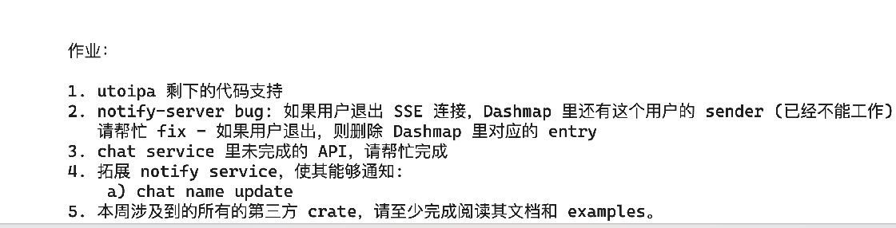

# Geektime Rust 语言训练营

## 第五周: 构建高性能的我互联网应用


> install sqlx-cli
>
> https://github.com/launchbadge/sqlx/tree/main/sqlx-cli
>
> ```bash
> cargo install sqlx-cli --no-default-features --features rustls,postgres
> ```

> 操作 postgres
>
> 1. psql
> 2. pgcli -> pip install pgcli

> postgresql基础命令
>
> ```bash
> createdb <name>;
> dropdb <name>;
> ```


>非对称加密:
>
>生成私钥: openssl genpkey -algorithm ed25519 -out encoding.pem
>
>生成公钥: openssl pkey -in chat_server/fixture/encoding.pem -pubout -out chat_server/fixture/decoding.pem



